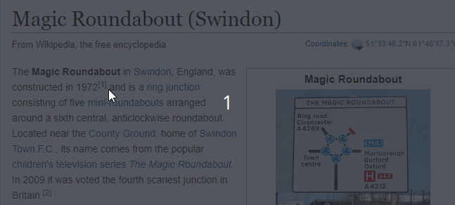

# Screen snipping tool (proof of concept)

Select an area on the screen, and displays the text.

It is possible to then perform various functions with the text, such as translation, dictionary lookup or speech.

## How it works

* A screenshot is taken, and displayed above other windows (this allows drawing on the screen, without other windows interfering).
* When a rectangular selection is made, it's OCR'd (by [tesseract](https://github.com/tesseract-ocr/tesseract)).
* The text is displayed.

## The parts

* UI is electron.
* OCR engine in .NET (the node.js wrapper of tesseract isn't good with Windows)

